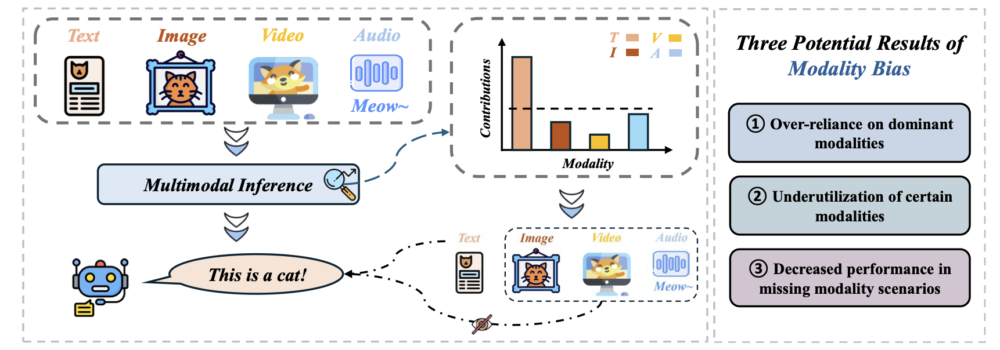
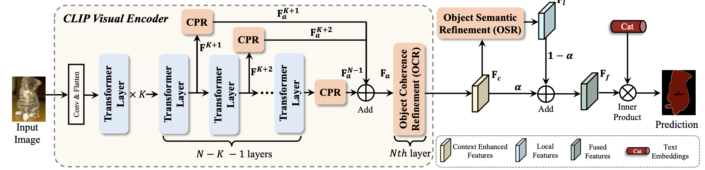
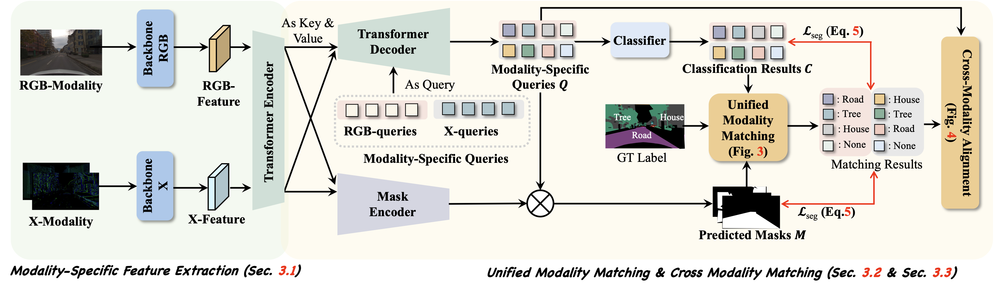
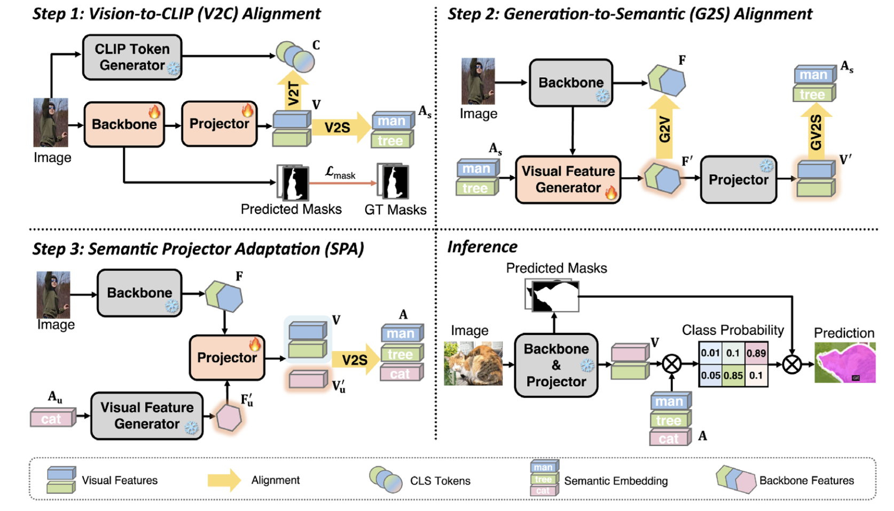
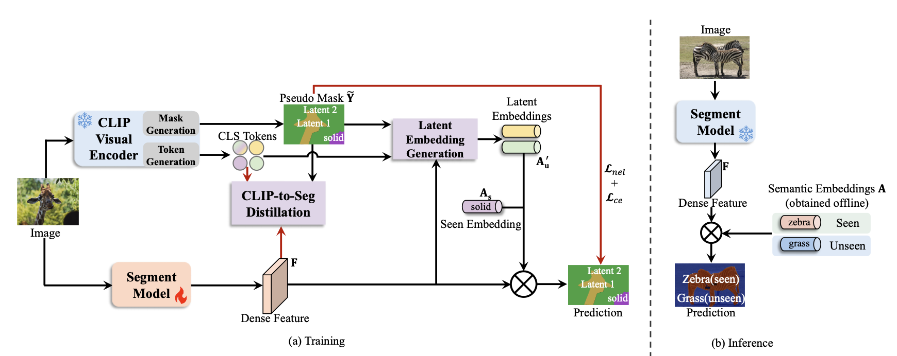
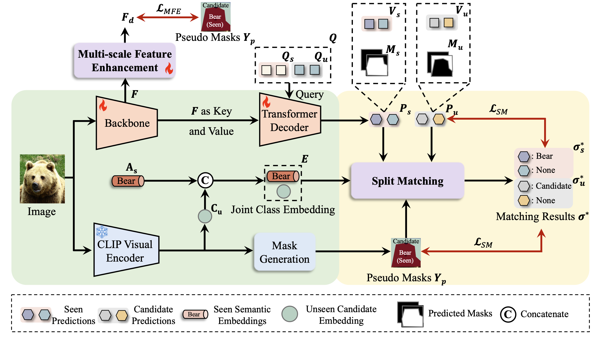
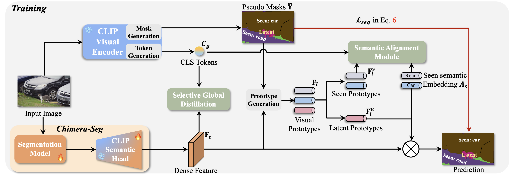
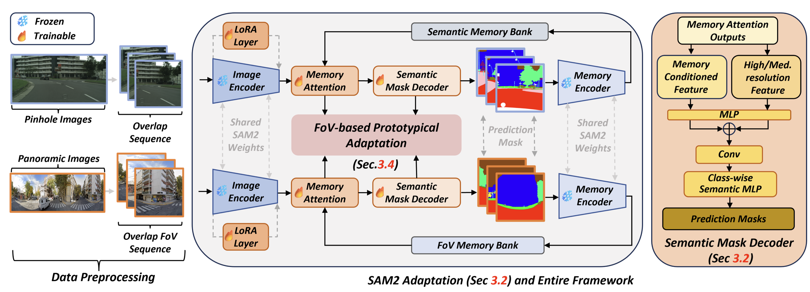
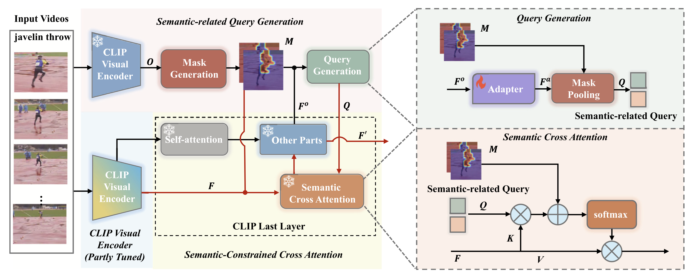
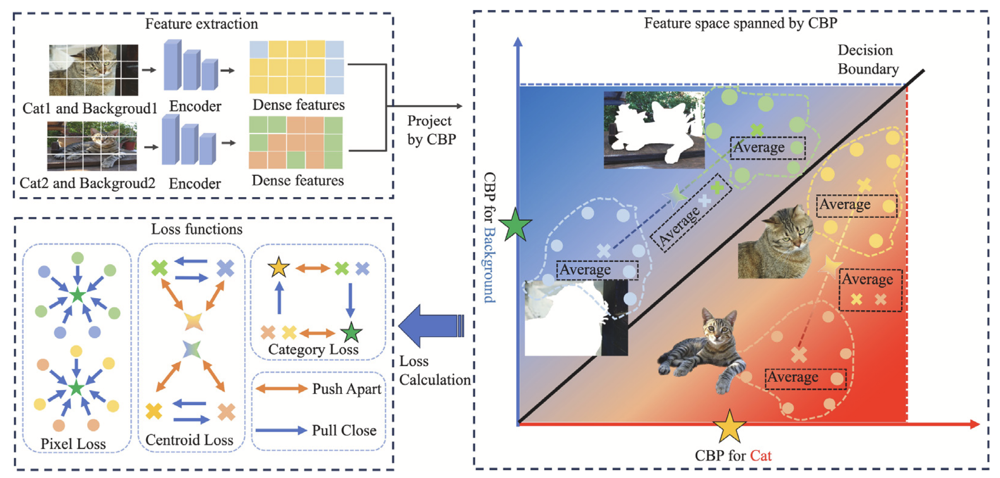

<!-- ICPR 2026 -->
<table>
<tr>
<td width="32%" valign="middle">
  
</td>
<td width="68%" valign="middle">

### [Resolving the Inherent Contextual Insufficiency in Referring Image Segmentation with Global Semantic Priors](https://link.springer.com/chapter/10.1007/978-3-032-31673-8_41)

🔥 **2026.04.01**

*International Conference on Pattern Recognition (**ICPR 2026**)*

</td>
</tr>
</table>

<!-- ICLR 2026 -->
<table>
<tr>
<td width="32%" valign="middle">
  
</td>
<td width="68%" valign="middle">

### [MLLMs are Deeply Affected by Modality Bias](https://arxiv.org/abs/2505.18657)

🔥 **2026.03.14**

*International Conference on Learning Representations (**ICLR 2026**)*

</td>
</tr>
</table>

<!-- IJCV 2026 -->
<table>
<tr>
<td width="32%" valign="middle">
  
</td>
<td width="68%" valign="middle">

### [Training-Free Open-Vocabulary Semantic Segmentation with Context Pyramid Refinement](https://link.springer.com/article/10.1007/s11263-026-02813-3)

🔥 **2026.03.03**

*International Journal of Computer Vision (**IJCV**), 2026.*

</td>
</tr>
</table>

<!-- TMM 2026 -->
<table>
<tr>
<td width="32%" valign="middle">
  
</td>
<td width="68%" valign="middle">

### [BiXFormer: A Robust Framework for Maximizing Modality Effectiveness in Multi-Modal Semantic Segmentation](https://ieeexplore.ieee.org/stamp/stamp.jsp?arnumber=11563662)

🔥 **2026.02.09**

*IEEE Transactions on Multimedia (**TMM**), 2026.*

</td>
</tr>
</table>

<!-- IJCV 2025 -->
<table>
<tr>
<td width="32%" valign="middle">
  
</td>
<td width="68%" valign="middle">

### [Semantic-Centric Alignment for Zero-shot Panoptic Segmentation with Limited Data](https://link.springer.com/article/10.1007/s11263-025-02648-4)

🔥 **2025.10.14**

*International Journal of Computer Vision (**IJCV**), 2025.*

</td>
</tr>
</table>

<!-- TCSVT 2025 -->
<table>
<tr>
<td width="32%" valign="middle">
  
</td>
<td width="68%" valign="middle">

### [CLIP-to-Seg Distillation for Zero-shot Semantic Segmentation](https://doi.org/10.1109/TCSVT.2025.3616588)

🔥 **2025.09.29**

*IEEE Transactions on Circuits and Systems for Video Technology (**TCSVT**), 2025.*

</td>
</tr>
</table>

<!-- BMVC 2025 -->
<table>
<tr>
<td width="32%" valign="middle">
  
</td>
<td width="68%" valign="middle">

### [Split Matching for Inductive Zero-shot Semantic Segmentation](https://arxiv.org/pdf/2505.05023)

🔥 **2025.07.26**

*British Machine Vision Conference (**BMVC 2025**)*

</td>
</tr>
</table>

<!-- ITSC 2025 -->
<table>
<tr>
<td valign="middle">

### Two papers accepted by ITSC 2025

🔥 **2025.07.02**

*IEEE Intelligent Transportation Systems Conference (**ITSC 2025**)*

</td>
</tr>
</table>

<!-- Chimera-Seg -->
<table>
<tr>
<td width="32%" valign="middle">
  
</td>
<td width="68%" valign="middle">

### [Partial CLIP is Enough: Chimera-Seg for Zero-shot Semantic Segmentation](https://arxiv.org/abs/2506.22032)

🔥 **2025.06.30**

*Preprint available on arXiv.*

</td>
</tr>
</table>

<!-- ICCV 2025 -->
<table>
<tr>
<td width="32%" valign="middle">
  
</td>
<td width="68%" valign="middle">

### [OmniSAM: Omnidirectional Segment Anything Model for UDA in Panoramic Semantic Segmentation](https://openaccess.thecvf.com/content/ICCV2025/papers/Zhong_OmniSAM_Omnidirectional_Segment_Anything_Model_for_UDA_in_Panoramic_Semantic_ICCV_2025_paper.pdf)

🔥 **2025.06.25**

*IEEE/CVF International Conference on Computer Vision (**ICCV 2025**)*

**Highlight**

</td>
</tr>
</table>

<!-- Pattern Recognition 2025 -->
<table>
<tr>
<td width="32%" valign="middle">
  
</td>
<td width="68%" valign="middle">

### [Semantic Matters: A Semantic Constrained Approach for Zero-Shot Video Action Recognition](https://papers.ssrn.com/sol3/papers.cfm?abstract_id=5017234)

🔥 **2025.01.19**

Zhenzhen Quan, <u>Jialei Chen</u>, Daisuke Deguchi, Jie Sun, Chenkai Zhang, Yujun Li, Hiroshi Murase

*Pattern Recognition*

</td>
</tr>
</table>

<!-- T-ITS 2024 -->
<table>
<tr>
<td valign="middle">

### [Towards Explainable End-to-End Driving Models via Simplified Objectification Constraints](https://ieeexplore.ieee.org/document/10505932)

🔥 **2024.04.04**

*IEEE Transactions on Intelligent Transportation Systems (**T-ITS**)*

</td>
</tr>
</table>

<!-- Pattern Recognition 2024 -->
<table>
<tr>
<td width="32%" valign="middle">
  
</td>
<td width="68%" valign="middle">

### [Frozen is Better than Learning: A New Design of Prototype-based Classifier for Semantic Segmentation](https://doi.org/10.1016/j.patcog.2024.110431)

🔥 **2024.03.14**

*Pattern Recognition*

</td>
</tr>
</table>
